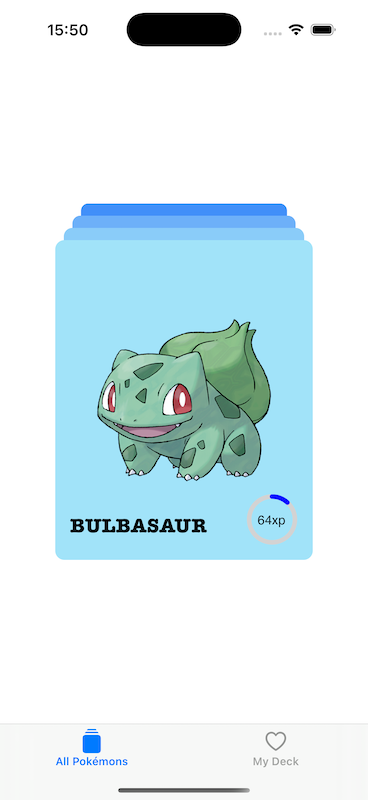

# Pokemon Colletors app

## How to run the app

1. `bun install`
2. `bun expo prebuild --clean`
3. `bun expo start`
3. `bun android` or `bun ios`

If you want to build release version of app use this command: `bun expo run:android --variant release` (recommended for testing performance).

## Screenshot

[Longer video showcase](https://www.youtube.com/watch?v=GCXu3iUBsfI)

[Quick preview](./preview_720p.mp4)

